# 📷 Ragi Instant App Gallery & Interface Demo

This document showcases the full suite of interfaces, pages, and interactive features of **Ragi Instant — Regulatory Intelligence Dashboard**.

---

## 🚀 1. Application Startup & Dashboard

### Native-like Startup Splash Screen
When the application first loads, a cinematic startup splash screen greets the user with an animated glowing ambient backdrop and high-resolution brand banner.

  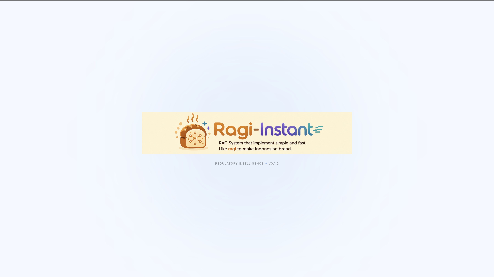

### Main System Dashboard
The home page features a modern glassmorphic dashboard showcasing vital statistics, indexing health metrics, historical latency charts, and recent document ingestion streams.

  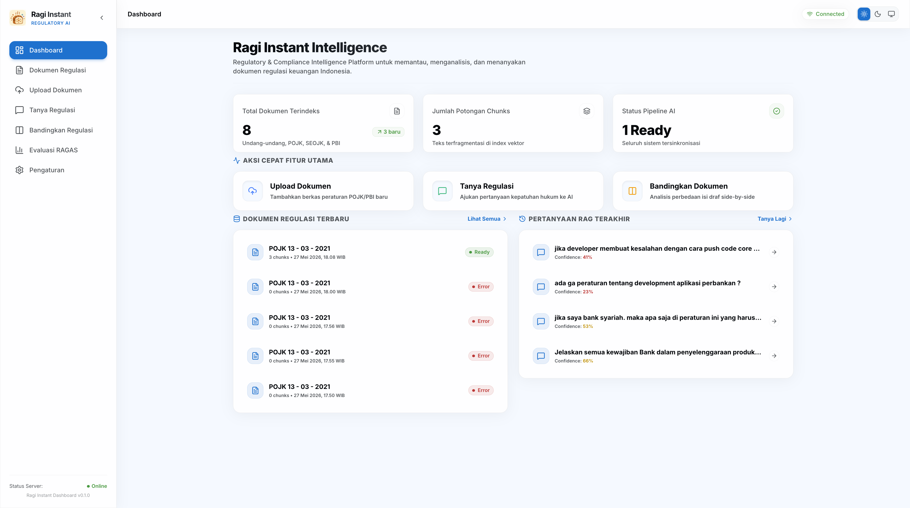

---

## 📂 2. Document & Ingestion Management

### Regulatory Document Library
A unified repository page listing all indexed POJK, PBI, and other financial regulations with active search, category filtering, and ingestion state badges.

  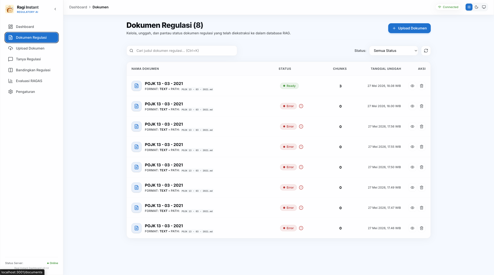

### Deep Ingestion & Semantic Chunk Inspector
Inspect specific documents at a granular level. View semantic chunks, layout-aware parses (tables, sections), metadata maps, and embedding vectors.

  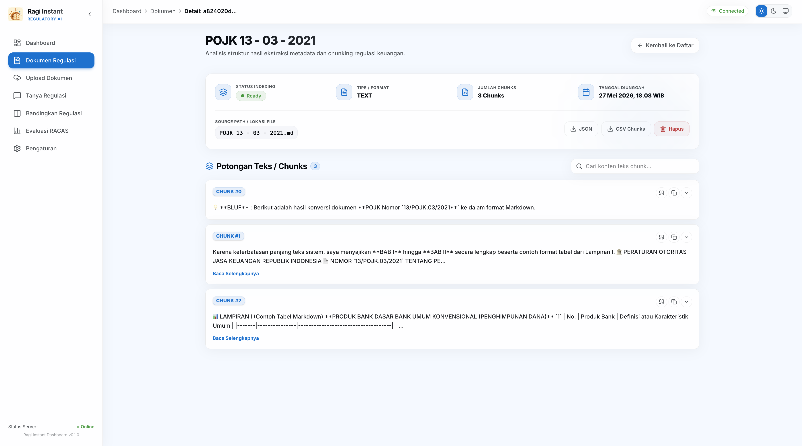

### Drag-and-Drop Document Uploader
A premium card interface allowing legal and compliance officers to drop multi-page PDF or DOCX regulations directly into the ingestion pipeline.

  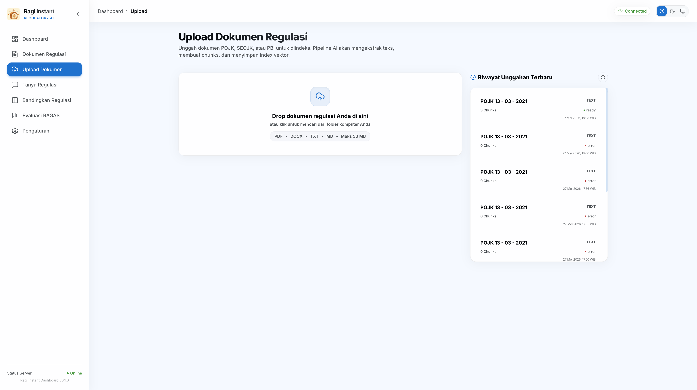

### Real-Time Pipeline Progress Tracing
The document ingestion process visualizes progress in real-time, showing steps from layout parsing (Docling) to semantic chunking (LlamaIndex) and pgvector embedding generation.

| Phase 1: Layout Parsing | Phase 2: Embedding Generation | Ingestion Complete |
|---|---|---|
| 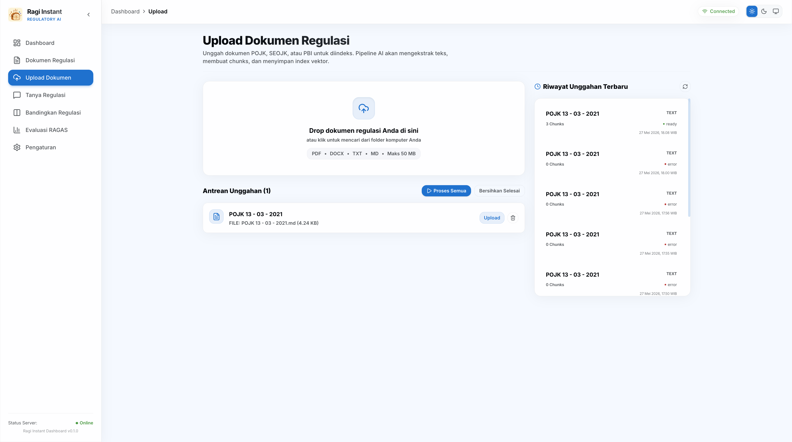 | 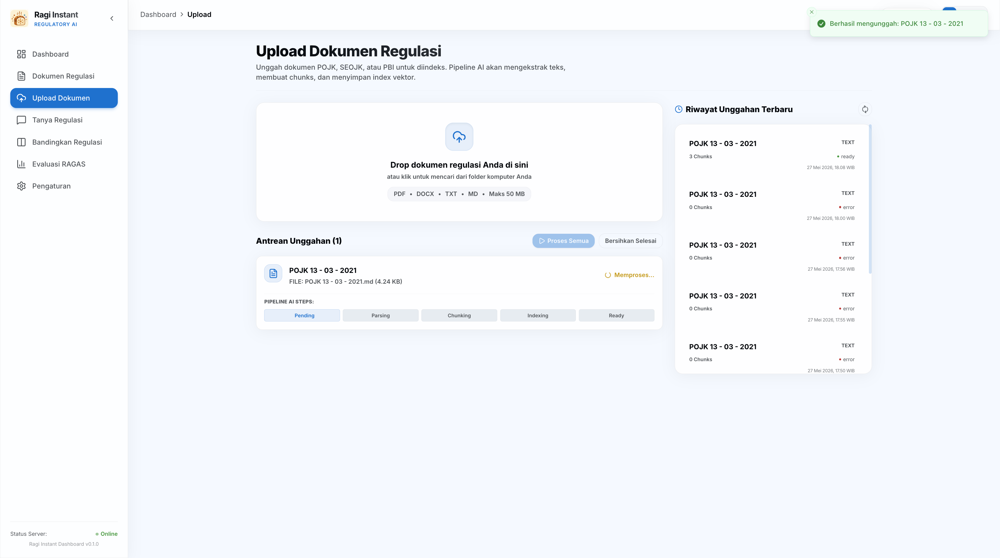 | 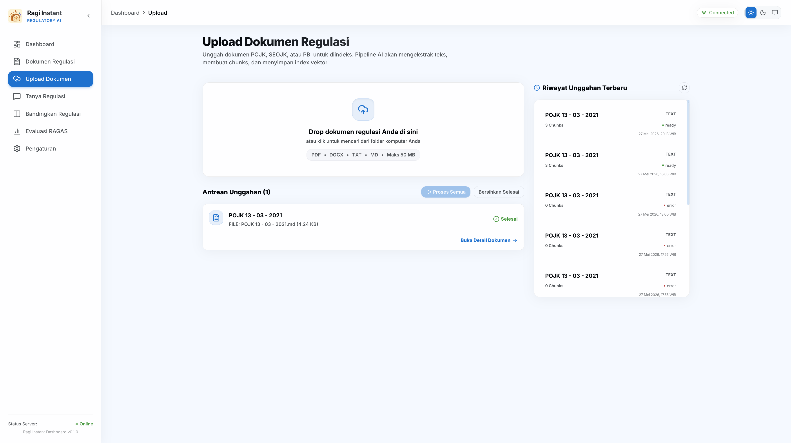 |

---

## 💬 3. AI Regulatory Q&A System

### AI Query Workspace
An interactive, distraction-free playground where compliance officers can query complex regulations, featuring pre-set prompt ideas.

  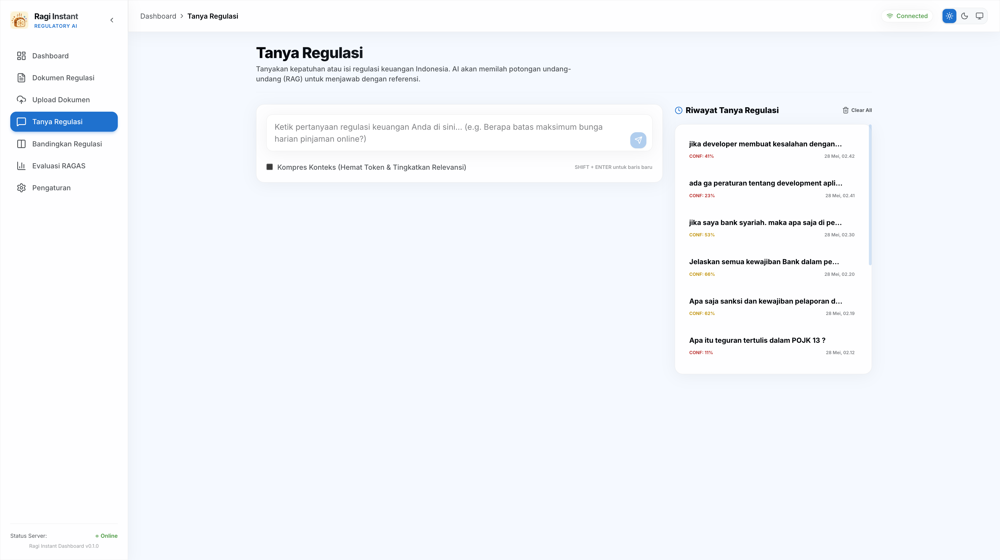

### Comprehensive Hybrid Search Answers
Ragi Instant combines dense pgvector semantic matches and sparse PostgreSQL keyword FTS to yield incredibly precise answers with legal claim citations, confidence, and hallucination scores.

  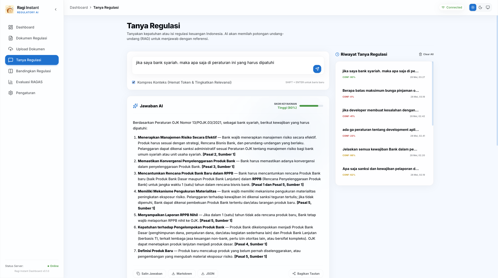

### Verifiable Citation Tooltips
hovering over claims highlights the exact article, page number, and quote inside the source regulation, ensuring black-box-free trust.

  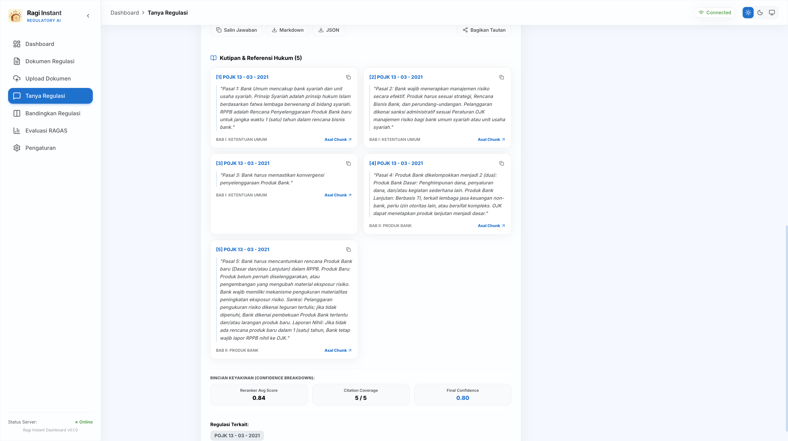

### Robust Fallback Handling
When information does not exist in the uploaded regulations, the system displays clean alerts without hallucinating.

| Low Confidence Disclaimer | No Matching Context Found |
|---|---|
| 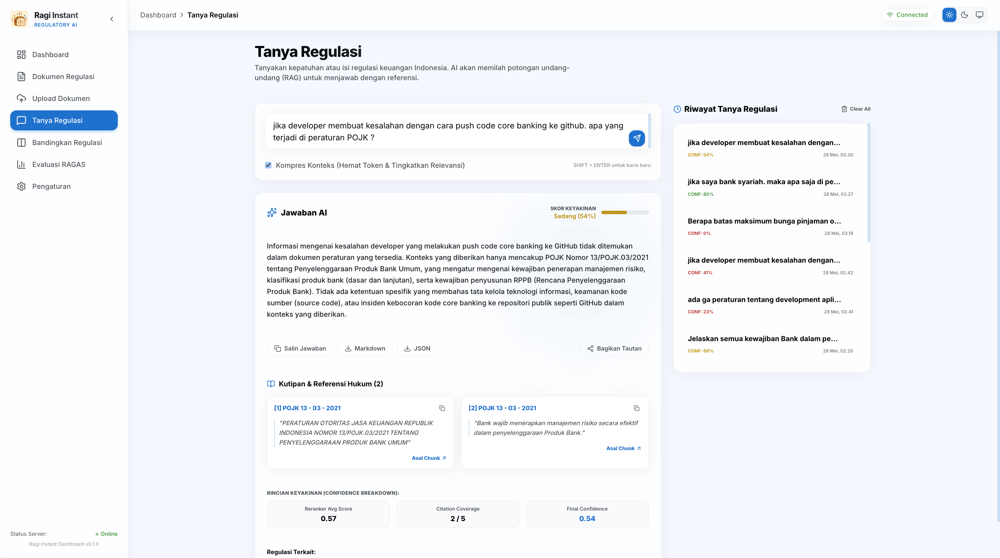 | 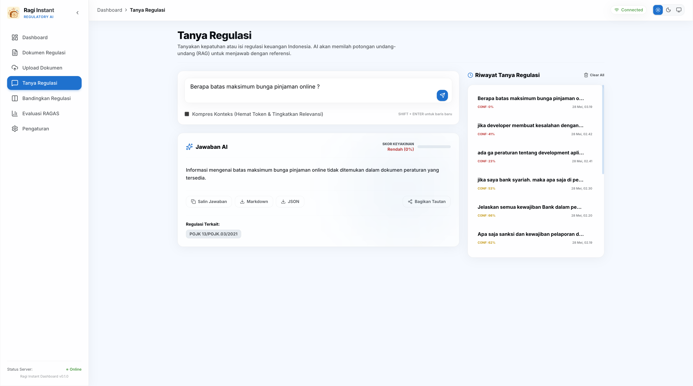 |

---

## ⚖️ 4. Advanced Analytics & Operations

### Regulatory Version Comparison
Upload two different versions of a regulation (e.g. POJK 2022 vs 2024 update) and get a structured, side-by-side legal diff highlighting modifications classified by impact.

  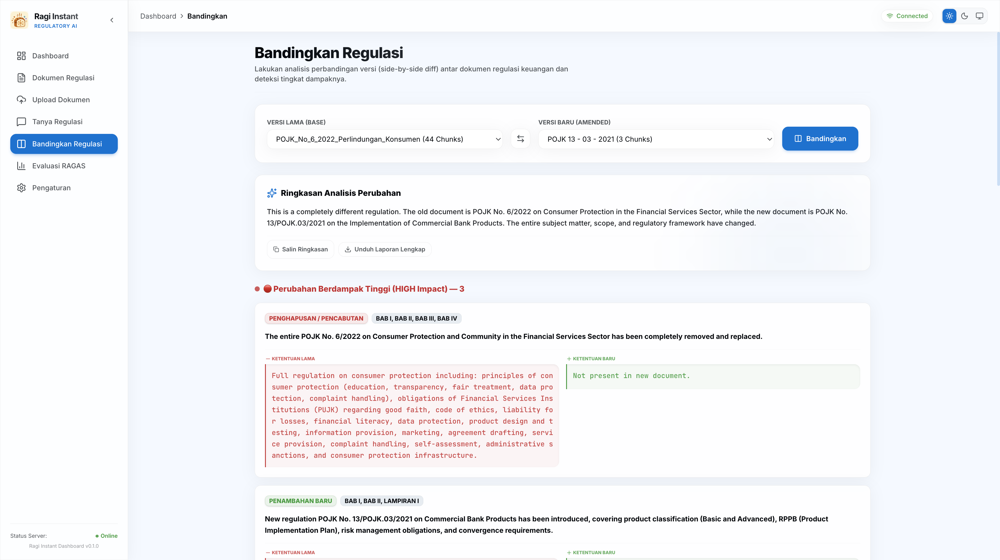

### Automated RAGAS Evaluation Dashboard
Shipped with numerical benchmarks. Automatically runs RAGAS evaluations over a curated golden Q&A dataset to measure Context Precision, Faithfulness, and Answer Relevancy.

  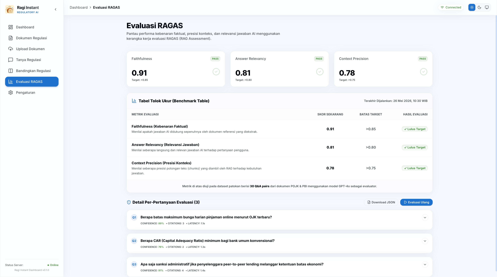

### System & Connection Settings
Configure backend API connection, adjust model hyperparameters (temperature, max tokens), edit default system prompts, or reset databases.

  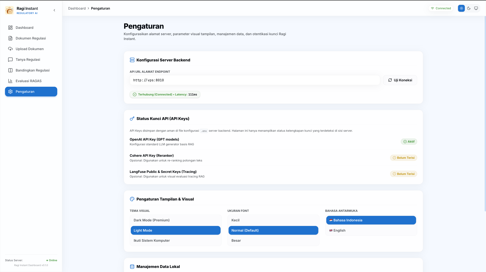

